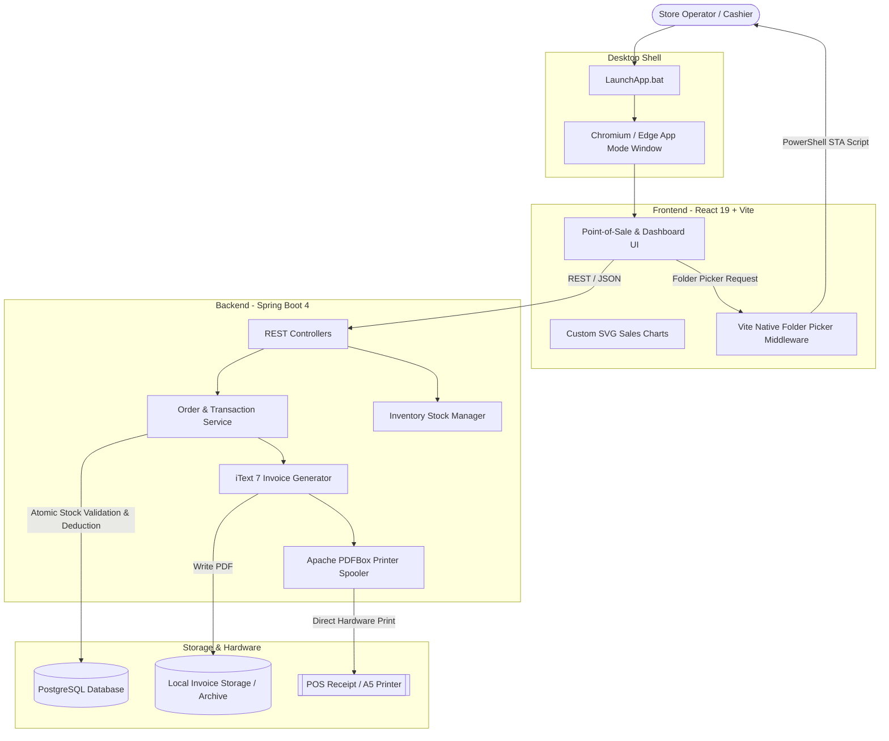

# Tyre Shop Billing & Inventory Management System

A full-stack point-of-sale (POS), tyre inventory management, and automated GST tax invoicing system built for **Akhil Enterprises** (authorized CEAT Tyres and multi-brand tyre retail dealer).

Packaged as a lightweight **desktop-hybrid web application**, the system combines a robust **Java 25 / Spring Boot** backend with a responsive **React 19 / Vite** single-page application and **PostgreSQL** database, featuring direct hardware printing, transactional inventory replenishment, and time-series analytics.

---

## Architecture Overview



---

## Key Features

### 1. Point of Sale & Order Lifecycle
- **Dual-Source Line Items**: Supports both store inventory products (with automated stock validation and deduction) and ad-hoc external items (one-off products or labour services without stock tracking).
- **Atomic Stock Management**:
  - Automatically validates stock availability before completing orders.
  - Automatically deduces stock on checkout.
  - Automatically restocks quantities when an order is updated or items are modified.
- **Soft Order Cancellation & Audit Trail**:
  - Cancelled orders are preserved for financial auditing (`isCancelled = true`, `cancelledAt`).
  - Automatically restores all associated physical product inventory back to stock.
  - Generates a stamped **"TAX INVOICE (CANCELLED)"** PDF and archives it into a dedicated `cancelled/` subfolder.

### 2. Automated GST Tax Invoicing & Direct Hardware Printing
- **A5 Tax Invoice Generation**: Powered by **iText 7**, producing professional GST-compliant invoices complete with HSN codes, split CGST/SGST tax breakdown, and company credentials.
- **Direct-to-Printer Spooling**: Uses **Apache PDFBox** and Java `PrinterJob` to automatically dispatch print jobs directly to POS/retail printers without manual browser print dialogs.
- **Interactive In-App Previews**: Preview, download, and reprint invoices on demand through the built-in PDF viewer modal.
- **Cross-Platform Path Resolution**: Self-healing invoice directory path configuration that normalizes and translates paths across Windows, macOS, and Linux.

### 3. Real-Time Sales Analytics Dashboard
- **7-Day Rolling Daily Trend**: Tracks daily sales performance over the past 7 days with interactive date selection.
- **12-Month Rolling Revenue Trend**: Aggregates month-by-month revenue over the past 12 months with year/month filters.
- **Native Time-Series Aggregation**: Driven by native PostgreSQL `generate_series` queries to guarantee accurate dates even on days with zero sales, automatically excluding cancelled orders.
- **Zero-Dependency SVG Visualizations**: Built with lightweight, custom interactive SVG charts and tooltips in React 19 without heavy external charting libraries.

### 4. Tyre Catalog & Inventory Management
- Manage tyre inventory by **Description**, **Size**, **HSN Code**, **GST %**, and **Stock Quantity**.
- Enforces uniqueness across product description and tyre size combinations.
- Real-time debounced search across multiple fields (description, size, HSN, quantity) to prevent API over-fetching.
- Server-side pagination with configurable page size and sorting.

### 5. Settings, GST Slabs & Customization
- **Configurable Starting Invoice Sequence**: Set and adjust active invoice counters dynamically.
- **Dynamic GST Tax Slabs**: Manage tax rates on the fly (e.g., 5%, 12%, 18%, 28%).
- **Native Folder Browser Dialog**: Select invoice destination directories on disk via native Windows folder picker integration.
- **Dark / Light Theme**: Built-in sleek dark and light modes with seamless CSS variable token switching and `localStorage` persistence.

---

## Technology Stack

| Layer | Technologies |
| :--- | :--- |
| **Backend Framework** | Java 25, Spring Boot 4.0.5 |
| **Data Persistence** | Spring Data JPA, Hibernate ORM 7.2.7, HikariCP |
| **Database** | PostgreSQL 18.3 |
| **Document Generation** | iText 7.0.4 (`kernel`, `layout`, `io`) |
| **Hardware Printing** | Apache PDFBox 2.0.30 (`PDDocument`, `PrinterJob`, `PDFPageable`) |
| **Frontend Framework** | React 19.2.8, React Router DOM 7.18.4, Vite 8.3.0 |
| **UI Components & Icons** | Vanilla CSS (design tokens), Lucide React, `react-hot-toast` |
| **Desktop Launcher** | Windows Batch Script (`LaunchApp.bat`), PowerShell STA Dialog (`picker.ps1`) |
| **Testing** | JUnit 5, Mockito, Spring Boot Test |

---

## Getting Started

### Prerequisites
Ensure the following are installed on your machine:
- **Java Development Kit (JDK) 25**
- **Node.js (v18+ or v20+)** and **npm**
- **PostgreSQL (v15+)** running locally on port `5432`

---

### Database Setup
1. Open PostgreSQL (via `psql` or pgAdmin) and create the database:
   ```sql
   CREATE DATABASE "TyreShop";
   ```
2. Verify or update your database credentials in `src/main/resources/application.properties`:
   ```properties
   spring.application.name=TyreShopBilling
   spring.datasource.url=jdbc:postgresql://localhost:5432/TyreShop
   spring.datasource.username=postgres
   spring.datasource.password=your_password_here
   spring.datasource.driver-class-name=org.postgresql.Driver

   spring.jpa.hibernate.ddl-auto=update
   ```

---

### Running the Application

#### Option A: One-Click Desktop Launch (Windows)
Double-click **`LaunchApp.bat`** or run it from terminal:
```cmd
.\LaunchApp.bat
```
*This script automatically verifies ports 8080 and 5173, starts Spring Boot and Vite in the background, and opens the application in a standalone, borderless desktop browser window.*

---

#### Option B: Manual Execution

**1. Start the Spring Boot Backend:**
```bash
# Windows
.\mvnw.cmd spring-boot:run

# Linux / macOS
./mvnw spring-boot:run
```
*The backend starts at `http://localhost:8080`.*

**2. Start the React Frontend:**
```bash
cd frontend
npm install
npm run dev
```
*The frontend starts at `http://localhost:5173` with reverse-proxying configured to `http://localhost:8080/api`.*

---

## API Reference

### Products (`/api`)
| Method | Endpoint | Description |
| :--- | :--- | :--- |
| `GET` | `/api/products` | Retrieve all products |
| `GET` | `/api/products/paged` | Get paged & searchable product list (`page`, `size`, `sortBy`, `sortDir`, `search`) |
| `GET` | `/api/product/{id}` | Get product details by ID |
| `POST` | `/api/products` | Add a new product to inventory |
| `PUT` | `/api/product/{id}` | Update product details and stock |
| `DELETE` | `/api/product/{id}` | Delete a product from inventory |

### Orders & Billing (`/api`)
| Method | Endpoint | Description |
| :--- | :--- | :--- |
| `GET` | `/api/orders` | Retrieve list of orders (optional `?cancelled=true/false`) |
| `GET` | `/api/orders/paged` | Paginated search of active orders |
| `GET` | `/api/orders/cancelled/paged` | Paginated search of cancelled orders |
| `GET` | `/api/order/{id}` | Get complete order details by order ID |
| `POST` | `/api/order` | Create order, validate & deduct stock, generate PDF, and spool to printer |
| `PUT` | `/api/order/{id}` | Update products in an order (automatically restocks and re-deducts) |
| `PUT` | `/api/order/{id}/customer` | Update customer billing information for an order |
| `PUT` | `/api/order/{id}/cancel` | Cancel order, restock items, update PDF watermark to CANCELLED |
| `GET` | `/api/order/{id}/invoice` | Download or view the raw generated PDF invoice |
| `POST` | `/api/order/{id}/invoice/print` | Re-send invoice to the system default printer |

### Sales Analytics (`/api/sales`)
| Method | Endpoint | Description |
| :--- | :--- | :--- |
| `GET` | `/api/sales/day?date=YYYY-MM-DD` | Rolling 7-day sales breakdown up to the specified date |
| `GET` | `/api/sales/month?year=YYYY&month=MM` | Rolling 12-month revenue aggregation up to specified month/year |

### Settings & Configuration (`/api`)
| Method | Endpoint | Description |
| :--- | :--- | :--- |
| `GET` | `/api/order/invoicePath` | Get active folder path for PDF invoice storage |
| `PUT` | `/api/order/invoicePath` | Update folder path for saving PDF invoices |
| `PUT` | `/api/order/invoice/{number}` | Update active starting invoice sequence counter |
| `GET` | `/api/gst` | List all configured GST percentage slabs |
| `POST` | `/api/gst/{gst}` | Add a new GST tax percentage slab |
| `DELETE` | `/api/gst/{gstId}` | Remove an existing GST tax slab |

---

## Directory Structure

```text
TyreShopBilling/
|-- LaunchApp.bat                 # One-click desktop app runner
|-- pom.xml                       # Maven build file with Java 25 & Spring Boot 4
|-- src/
|   |-- main/
|   |   |-- java/com/BillingSystem/TyreShopBilling/
|   |   |   |-- TyreShopBillingApplication.java
|   |   |   |-- InvoiceGenerator.java       # iText7 A5 PDF layout & Apache PDFBox printing
|   |   |   |-- config/CorsConfig.java     # Cross-origin policy configuration
|   |   |   |-- controller/                # REST Controllers (Orders, Products, Sales, GST, Settings)
|   |   |   |-- exception/                 # Global exception handler & domain errors
|   |   |   |-- model/                     # JPA Entities (Product, Orders, OrderedProducts, GST, etc.)
|   |   |   |-- repository/                # Spring Data JPA repositories & native SQL queries
|   |   |   `-- service/                   # Transactional business logic & stock validation
|   |   `-- resources/
|   |       `-- application.properties     # PostgreSQL & JPA settings
|   `-- test/                              # Unit, Mockito, and slice integration tests
|-- frontend/
|   |-- package.json                       # React 19 dependencies & scripts
|   |-- vite.config.js                     # Vite configuration & native folder picker plugin
|   |-- picker.ps1                         # PowerShell script for native Windows folder dialog
|   `-- src/
|       |-- api.js                         # Centralized fetch API client
|       |-- App.jsx                        # Layout shell, sidebar navigation, top bar
|       |-- index.css                      # Design tokens, themes (dark/light), typography
|       |-- components/
|       |   |-- DaySalesGraph.jsx          # Interactive SVG 7-day sales chart
|       |   |-- MonthSalesGraph.jsx        # Interactive SVG 12-month sales chart
|       |   |-- InvoiceModal.jsx           # In-app PDF invoice viewer modal
|       |   `-- ThemeToggle.jsx            # Dark / Light mode switcher
|       |-- context/ThemeContext.jsx       # Theme state & localStorage provider
|       `-- pages/
|           |-- Dashboard.jsx              # Dual-mode analytics & store summary
|           |-- Products.jsx               # Tyre inventory catalog, search & pagination
|           |-- Orders.jsx                 # POS order creation, customer details & item selection
|           |-- Sales.jsx                  # Standalone sales analytics view
|           |-- Settings.jsx               # Path picker, invoice sequence & GST slab manager
|           `-- InvoiceViewer.jsx          # Dedicated full-page invoice viewer
`-- README.md
```

---

## Testing

Run the automated test suite using Maven:
```bash
# Windows
.\mvnw.cmd test

# Linux / macOS
./mvnw test
```
The test suite covers:
- **SalesServiceTest**: Time-series calculations and repository mock interactions.
- **ValidationTests**: DTO validation for products and orders.
- **PaginationTests**: Pageable queries, sorting, and search filtering.
- **ControllerValidationTests**: API constraint verification.

---

## License

This project is developed for **Akhil Enterprises Tyre Shop Billing System**. All rights reserved.